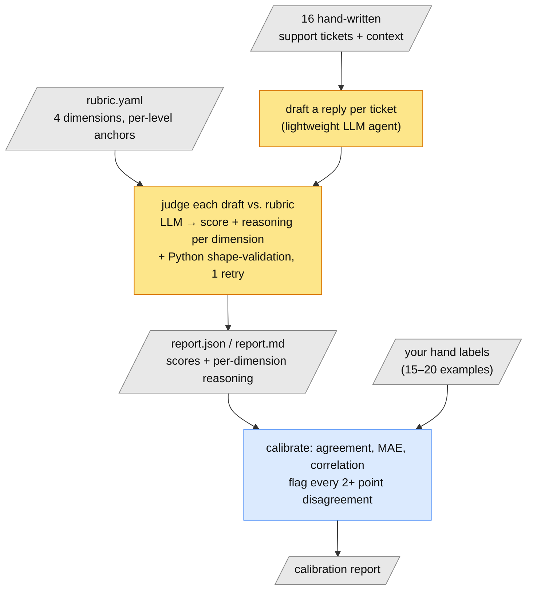
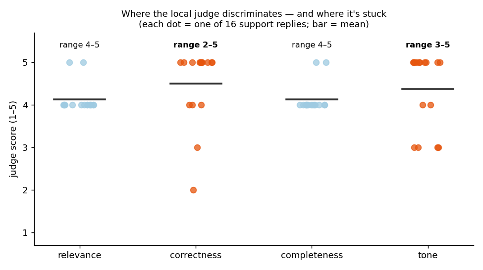

# LLM Output Quality Scorer

> Give it a customer message, the account/policy context, and an AI-drafted reply → get back a
> 1–5 score on four dimensions, each with written reasoning.

**TL;DR**
- **What it does** — turns "is this AI output good enough to ship?" from a vibe check into a
  repeatable measurement, using an LLM as the judge.
- **How the AI does the work** — a written rubric (four dimensions, each with explicit "what a 2
  looks like vs. a 4" anchors) is handed to a model along with the reply to grade; the model
  returns a score *and its reasoning* per dimension. Then a calibration step checks those
  scores against a human's.
- **Ran on** — 16 hand-written support tickets spanning easy cases, angry escalations, vague
  messages, and traps in the context; AI-drafted replies for each.
- **Headline result** — the judge discriminates well on **correctness** (scores 2–5) and
  **tone** (3–5) but is stuck at 4 on **relevance** and **completeness** — a real, measured
  weakness of using a small local model as judge, disclosed rather than hidden.
- **Try it** — `ollama pull llama3.2 && pip install -r requirements.txt`, then `cli score`.

See [CLAUDE.md](./CLAUDE.md) for full scope. Part of a broader portfolio; see the parent
[CLAUDE.md](../CLAUDE.md).

---

## The problem

Every team shipping an AI feature eventually asks "is the output good enough?" and usually
answers by eyeballing a handful of examples. That doesn't scale, isn't consistent between
people, and doesn't hold up in a launch review. "LLM-as-judge" — using one model to grade
another's output against a rubric — is the standard way teams turn that into a number. But it's
only trustworthy if two things are true: the rubric is specific enough that the judge is
consistent, and someone has checked the judge's scores against a human's.

This project builds the whole loop — rubric, judge, calibration — for AI-drafted customer
support replies, and reports honestly where the judge and a human disagree.

**You'd use this to** decide whether an AI drafting feature is ready to ship, catch regressions
between prompt versions, or give eng/design a shared definition of "good" instead of an argument.

## How it works

1. **Write the rubric first** *(human)* — before any code: 4 dimensions (relevance, correctness,
   completeness, tone), each 1–5, and for each score a written anchor — what a 2 looks like
   versus a 4. Without that anchoring an LLM judge gives inconsistent scores for the same
   quality of output. Lives in [`rubric.yaml`](rubric.yaml), version-controlled, because the
   rubric *is* the product.
2. **Build a test set** *(human)* — 16 realistic support tickets, hand-written to span a real
   difficulty range: straightforward refunds, an angry third-email escalation, a deliberately
   vague "my account is kind of messed up", a customer stacking three complaints, and cases with
   a trap in the context (a promo code that looks expired but was shown as valid due to a
   confirmed bug — the reply is supposed to catch that).
3. **Generate draft replies** *(AI — LLM)* — a deliberately lightweight, minimally-prompted
   agent drafts a reply per ticket, standing in for the "first version" feature a team would be
   evaluating.
4. **Judge** *(AI — LLM, one call per ticket)* — the model scores each draft against the rubric,
   returning a score plus a written reason for every dimension. Python then validates the shape
   (dimension names, score ranges) and retries once if the model returns something malformed.
5. **Calibrate** *(human + code)* — you label 15–20 examples yourself; the tool computes
   agreement rate, mean error, and correlation, and specifically surfaces every case where the
   model and human disagree by 2+ points. This is the step that proves the judge is trustworthy,
   not just plausible.



## What it ran on

**Inputs:** 16 hand-written support tickets in [data/tickets.jsonl](data/tickets.jsonl), each
with a customer message and the account/policy context a real agent would have. Written (not
sampled from a real queue) so the difficulty range is deliberate and every trap is known.
AI-drafted replies for all 16 in
[data/tickets_with_replies.jsonl](data/tickets_with_replies.jsonl).

**Known limitations of the inputs:**

- **16 examples is small.** Enough to show the judge's behavior and calibration method; not
  enough to certify a production judge.
- **One domain** (SaaS customer support). The rubric dimensions transfer; the anchors would need
  rewriting for, say, code review or medical triage.
- **Hand-written tickets** may be cleaner and more self-contained than a real support queue.

## Results

Real run against the 16-ticket set (full per-example reasoning in [report.md](report.md)):

| dimension | mean | min | max |
|---|---|---|---|
| relevance | 4.12 | 4 | 5 |
| correctness | 4.50 | 2 | 5 |
| completeness | 4.12 | 4 | 5 |
| tone | 4.38 | 3 | 5 |



*Each dot is one of the 16 replies. On correctness and tone the judge uses the whole scale; on
relevance and completeness every single reply scored 4 or 5 — including a deliberately vague
ticket a stronger judge would likely mark lower.*

One representative catch (`t04`, a login issue where the account was flagged for a bounced
verification email):

> **correctness: 2** — "The reply states that emails sent to j.torres@example.com have been
> bouncing since a typo was introduced during a profile edit, which is not accurate according to
> the provided context (unverified bounce flag set 2026-07-28)."

That's the judge correctly catching the draft reply overstating an internal diagnosis as
confirmed fact to the customer — the kind of catch this tool exists to make.

**Calibration** (details and honesty caveats in [Calibration](#calibration) below): an
independent re-scoring agreed within ±1 point on relevance and completeness (weak correlation,
no wild misses) and correlated best on correctness (r=0.62) — consistent with correctness being
the most fact-checkable dimension. The one 2+ point disagreement was `t15`, where the judge gave
a perfect correctness score to a reply that hedged on a fact ("we cannot confirm whether the
charge is indeed a duplicate") the context had *already confirmed*.

## What broke (and how I handled it)

1. **Two of four dimensions never varied.** Across all 16 examples, `relevance` and
   `completeness` never scored below 4 — even on `t10`, a near-contextless "my account is kind
   of messed up" where a careful judge could reasonably go lower. **Not fixed — disclosed:** it's
   a discrimination ceiling of a ~3B local model on subtler dimensions. `correctness` (2–5) and
   `tone` (3–5) show real spread and the *reasoning* attached to every score is specific and
   grounded, so the judge isn't failing outright — but the tight clustering is a real limitation,
   documented in Tradeoffs rather than smoothed over.
2. **The judge missed a hedge it should have caught.** On `t15` it scored correctness 5 for a
   reply that hedged on a fact the context confirmed. **Caught by** the calibration step's
   "flag every 2+ point disagreement" rule — which is exactly what that step is for. The fix
   isn't to the judge; it's that calibration surfaced a case a human needs to arbitrate.
3. **The small model won't honor a strict JSON schema.** `llama3.2` at this size ignores
   OpenAI-style structured-output constraints. **Fix (in code):** `scorer/judge.py` validates
   dimension names and score ranges itself after parsing, retries once, and raises clearly if
   the model still can't produce the right shape — rather than silently accepting malformed
   output.

## Design decisions (Tradeoffs)

Required per [CLAUDE.md](./CLAUDE.md):

1. **Local Ollama (`llama3.2`, ~3B params) as both drafter and judge, not a paid hosted API.**
   Chosen so the project runs at zero cost and anyone can reproduce it without an API key. The
   cost is real and measured: judge discrimination on `relevance` and `completeness` is visibly
   weaker than a frontier model would likely produce (see "What broke" #1). `correctness` and
   `tone` showed real spread and grounded reasoning, so the method holds — but the ceiling is
   disclosed, not hidden.
2. **All four dimensions scored in a single model call per example**, not one call per dimension
   (see `scorer/judge.py`). Cheaper and ~4× faster at local-model speeds, at the cost of true
   independence between dimension judgments. Worth revisiting if the rubric grows past ~4
   dimensions.
3. **Generic JSON mode + Python-side shape validation with one retry**, instead of strict schema
   structured outputs — because the small local model doesn't reliably honor a strict schema
   (see "What broke" #3).
4. **Calibration is against a human, and can't be faked.** The repo also contains a *weaker*
   check — Claude independently re-scored all 16 without seeing the judge's scores — kept in
   separately-named files (`claude_self_check_report.md`, `data/claude_labels.jsonl`) so it's
   never mistaken for the real thing. The real calibration checkbox in `CLAUDE.md` stays
   unchecked until a human fills in `data/human_labels.jsonl` via `labeling_worksheet.md`.

## Where not to trust it

- **A ~3B local judge under-discriminates on subtle dimensions.** Trust the *reasoning* more
  than the *number* on relevance/completeness; `--backend`-swapping to a stronger model is the
  fix if you need the numbers.
- **16 examples is a method demo, not a certified judge.** A production judge needs hundreds of
  calibrated examples and re-calibration whenever the rubric or model changes.
- **The rubric is domain-specific.** Dimension names transfer; the per-level anchors need
  rewriting per task.

**Before trusting this to gate a launch, you'd want to:** label 100+ examples yourself, report
judge-vs-human correlation per dimension, and re-run calibration on every rubric or model change.

## Try it yourself

Runs entirely against a local [Ollama](https://ollama.com) model — no API key, no billing.

```bash
ollama pull llama3.2
pip install -r requirements.txt

python3 -m scorer.cli generate-replies   # draft replies -> data/tickets_with_replies.jsonl
python3 -m scorer.cli score              # judge the drafts -> report.json + report.md
python3 -m scorer.make_worksheet         # build labeling_worksheet.md for human calibration
python3 -m scorer.cli calibrate          # compare report.json to data/human_labels.jsonl
python3 scripts/make_charts.py           # refresh outputs/score_spread.png
```

## Takeaways

- **If you build with AI:** LLM-as-judge is only as good as (a) how anchored the rubric is and
  (b) whether you've calibrated against a human. Skip either and the number is theater. And the
  judge's *reasoning* is the useful artifact for debugging — a bare score tells you nothing about
  why.
- **If you're making the product call:** "we tested it and it scored 4.4" means nothing without
  the calibration data behind it. Ask what the judge is, how many examples a human labeled, and
  where judge and human disagreed — those disagreements are where the real risk lives.
- **If you're just curious:** you can measure the quality of AI output fairly rigorously with
  more AI — but a human still has to check the checker, and a small model makes a noticeably
  blunter checker than a big one.

---

*Part of a portfolio of small, real AI projects — see the
[profile](https://github.com/ridhikagoel). I write these up in more depth in my newsletter,
**AI Explained Better**.*
